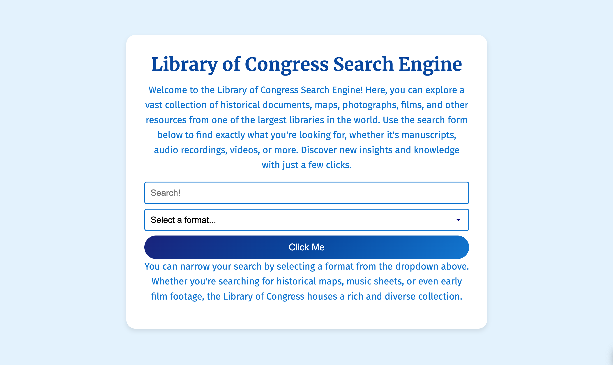
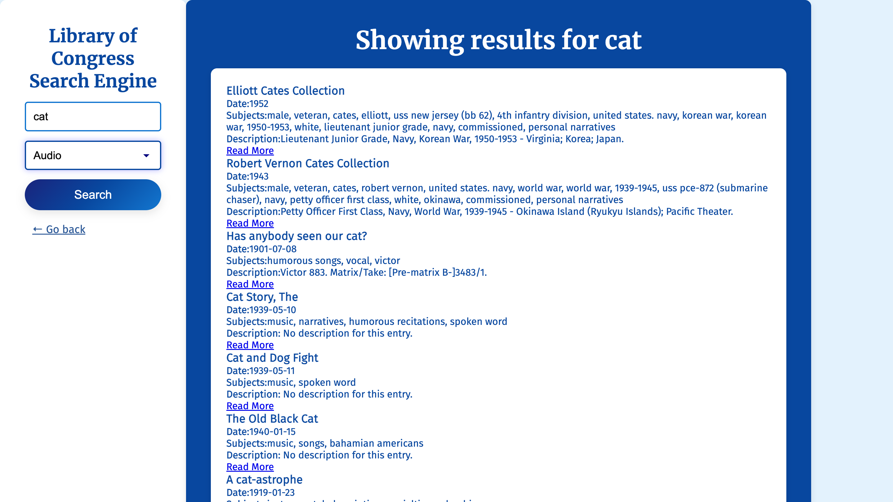

## Library of Congress Search Engine

## Table of Contents

1. [Project Overview](#project-overview)
2. [Features](#features)
3. [Project Structure](#project-structure)
4. [How to Use](#how-to-use)
    - [Prerequisites](#prerequisites)
    - [Steps to Use](#steps-to-use)
5. [Technical Implementation](#technical-implementation)
6. [License](#license)

## Project Overview

The **Library of Congress Search Tool** is a web application that allows users to search and explore the extensive collection of digital resources provided by the Library of Congress. The app integrates the Library of Congress API, enabling users to submit search queries, filter results by format, and view relevant search results on a dedicated page. It is designed to provide a seamless user experience for exploring books, manuscripts, images, audio, and other digital collections.

## Features

- **Search Functionality**: Users can perform a keyword-based search for resources and optionally filter the results by format (e.g., books, images, audio).
- **Search Results Page**: Displays the search results based on user queries, and users can perform additional searches directly from the results page.
- **Responsive Design**: The application is fully responsive, ensuring a user-friendly experience across different devices.
  
## Project Structure

- **Homepage (`index.html`)**: 
  - A clean user interface featuring a search form with a text input field and an optional format filter dropdown.
  - The form captures user input and redirects the user to the search results page with query parameters appended to the URL.
  
- **Search Results Page (`search-results.html`)**:
  - On page load, the app parses the query parameters from the URL and uses them to fetch relevant data from the Library of Congress API.
  - The results are displayed on the page using data from the `results` property of the API response.
  - The page includes a search form, allowing users to perform new searches directly without being redirected.

## Screenshot of pages
- 
- 

## How to Use

### Prerequisites

- Web browser (Google Chrome, Firefox, etc.)

### Steps to Use

1. **Search from Homepage**:
   - Open the `index.html` file in your browser.
   - Enter a keyword in the search input field.
   - Optionally, select a format from the dropdown menu to filter results (e.g., books, audio, images).
   - Submit the form to view the search results.

2. **View Search Results**:
   - After submitting the form, you will be redirected to the `search-results.html` page.
   - The results will be fetched from the Library of Congress API and displayed on the page.
   - You can conduct additional searches using the form on the results page, and the results will be updated accordingly.

## Technical Implementation

- **API**: The application uses the [Library of Congress API](https://www.loc.gov/apis/json-and-yaml/requests/) to fetch data for search results.
  - For more details on how the API works, refer to the API documentation on [requests](https://www.loc.gov/apis/json-and-yaml/requests/endpoints/) and [responses](https://www.loc.gov/apis/json-and-yaml/responses/search-results/).

- **JavaScript**: 
  - An event listener is attached to the search form to capture user input and redirect the user to the results page.
  - On the `search-results.html` page, the script fetches data from the Library of Congress API and displays the `results` on the page.

## License

This project is licensed under the MIT License.

